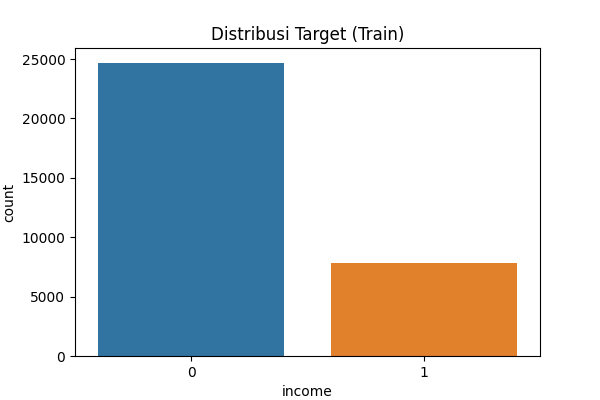
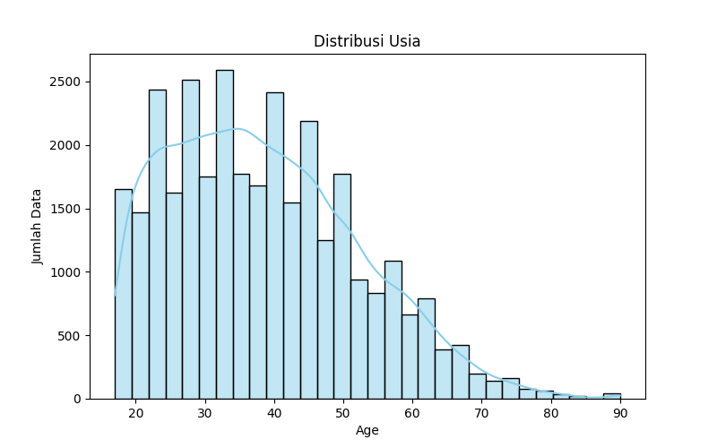
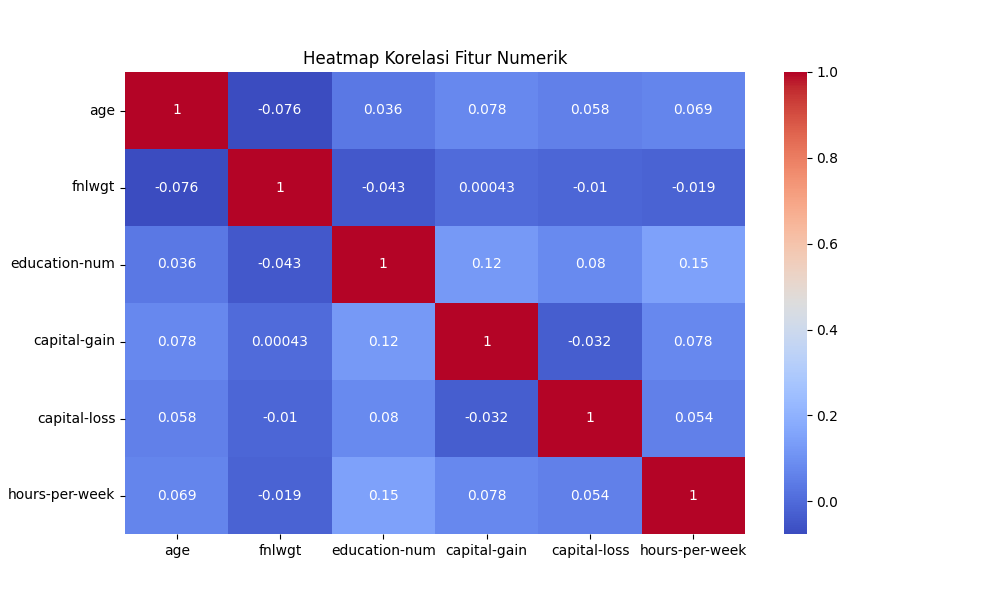

## INFORMASI PROYEK

**Judul Proyek:**  
[(Contoh: "Klasifikasi Penyakit Daun Menggunakan CNN", "Prediksi Harga Rumah dengan Machine Learning", "Analisis Sentimen Ulasan Produk")]

**Nama Mahasiswa:** ALFINDO OKTAVIAN RAMADHAN 
**NIM:** 233307001  
**Program Studi:** Teknologi Informasi   
**Mata Kuliah:** Data Science 
**Dosen Pengampu:** GUS NANANG SYAIFUDDIIN 
**Tahun Akademik:** 2025/5
**Link GitHub Repository:** https://github.com/alfindooktavian/project-ml.git 
**Link Video Pembahasan:** https://drive.google.com/file/d/105VQAco8SYl-759nEuwwcWuo9Vyru4pm/view?usp=sharing

---

## 1. LEARNING OUTCOMES
Pada proyek ini, mahasiswa diharapkan dapat:
1. Memahami konteks masalah dan merumuskan problem statement secara jelas
2. Melakukan analisis dan eksplorasi data (EDA) secara komprehensif (**OPSIONAL**)
3. Melakukan data preparation yang sesuai dengan karakteristik dataset
4. Mengembangkan tiga model machine learning yang terdiri dari (**WAJIB**):
   - Model baseline
   - Model machine learning / advanced
   - Model deep learning (**WAJIB**)
5. Menggunakan metrik evaluasi yang relevan dengan jenis tugas ML
6. Melaporkan hasil eksperimen secara ilmiah dan sistematis
7. Mengunggah seluruh kode proyek ke GitHub (**WAJIB**)
8. Menerapkan prinsip software engineering dalam pengembangan proyek

---

## 2. PROJECT OVERVIEW

### 2.1 Latar Belakang
Pendapatan individu merupakan salah satu indikator penting dalam analisis sosial dan ekonomi. Informasi mengenai tingkat pendapatan sering digunakan oleh pemerintah, institusi keuangan, dan perusahaan untuk keperluan perencanaan kebijakan, pemberian bantuan sosial, analisis pasar tenaga kerja, hingga pengambilan keputusan kredit. Namun, proses penentuan kategori pendapatan sering kali melibatkan banyak faktor seperti tingkat pendidikan, jenis pekerjaan, usia, jam kerja, status pernikahan, dan latar belakang sosial ekonomi lainnya.
Dataset Adult UCI merupakan dataset publik yang banyak digunakan dalam penelitian machine learning, khususnya untuk tugas klasifikasi pendapatan. Dataset ini berisi data individu dengan berbagai atribut demografis dan pekerjaan, dengan tujuan memprediksi apakah pendapatan seseorang berada di atas atau di bawah batas tertentu (>$50K atau ≤$50K per tahun). Dataset ini memiliki karakteristik data kategorikal dan numerik, serta ketidakseimbangan kelas, sehingga menantang dan relevan untuk diterapkan berbagai metode klasifikasi.
Dengan perkembangan teknologi data science dan kecerdasan buatan, machine learning dan deep learning dapat dimanfaatkan untuk membangun sistem prediksi pendapatan yang lebih akurat dan konsisten. Melalui pendekatan ini, pola-pola penting yang memengaruhi tingkat pendapatan dapat diidentifikasi secara sistematis berdasarkan data historis. Selain itu, penggunaan teknik balancing data dan evaluasi model yang tepat dapat meningkatkan performa prediksi pada data yang tidak seimbang.
Pada proyek ini, mahasiswa mengembangkan tiga pendekatan model, yaitu model baseline menggunakan Logistic Regression, model machine learning lanjutan menggunakan Random Forest, serta model deep learning menggunakan Multilayer Perceptron (MLP). Ketiga model tersebut dibandingkan berdasarkan metrik evaluasi seperti accuracy, precision, recall, dan F1-score untuk menentukan model terbaik dalam melakukan klasifikasi pendapatan.
Hasil dari proyek ini diharapkan dapat memberikan pemahaman mengenai faktor-faktor utama yang memengaruhi tingkat pendapatan individu serta menunjukkan perbandingan performa antara pendekatan machine learning konvensional dan deep learning dalam menyelesaikan permasalahan klasifikasi data tabular.

Daftar Referensi (APA 5th Edision)
Dua, D., & Graff, C. (2019). UCI Machine Learning Repository. Irvine, CA: University of California, School of Information and Computer Science.)
Han, J., Kamber, M., & Pei, J. (2012). Data Mining: Concepts and Techniques (3rd ed.). Morgan Kaufmann.
*

## 3. BUSINESS UNDERSTANDING / PROBLEM UNDERSTANDING

### 3.1 Problem Statements
1. Penentuan tingkat pendapatan individu secara manual berdasarkan faktor demografis dan pekerjaan sering bersifat subjektif dan tidak konsisten, sehingga diperlukan model klasifikasi yang mampu memprediksi tingkat pendapatan secara akurat dan objektif.
2. Dataset Adult UCI memiliki kombinasi fitur numerik dan kategorikal dengan karakteristik yang beragam serta adanya ketidakseimbangan kelas, sehingga membutuhkan proses preprocessing yang tepat agar model dapat mempelajari pola data secara optimal.
3. Belum diketahui faktor-faktor apa saja yang paling berpengaruh dalam menentukan apakah pendapatan individu berada di atas atau di bawah batas tertentu (>$50K atau ≤$50K), sehingga diperlukan analisis feature importance untuk memahami faktor penentu tingkat pendapatan.
4. Diperlukan perbandingan performa antara model baseline, model machine learning lanjutan, dan model deep learning untuk menentukan pendekatan terbaik dalam melakukan klasifikasi pendapatan individu.

### 3.2 Goals
1. Mengembangkan tiga model klasifikasi yang terdiri dari model baseline, model machine learning lanjutan, dan model deep learning untuk memprediksi tingkat pendapatan individu menggunakan dataset Adult UCI.
2. Mencapai akurasi klasifikasi minimal ≥ 80% pada model terbaik sebagai indikator keberhasilan prediksi tingkat pendapatan.
3. Melakukan preprocessing data secara tepat, termasuk encoding fitur kategorikal, penanganan data tidak seimbang, serta pembagian data train dan validation agar model dapat belajar secara optimal.
4. Mengevaluasi dan membandingkan performa ketiga model menggunakan metrik evaluasi seperti accuracy, precision, recall, dan F1-score untuk menentukan model yang paling efektif.
5. Mengidentifikasi fitur-fitur yang paling berpengaruh terhadap tingkat pendapatan individu melalui analisis feature importance pada model machine learning lanjutan.

### 3.3 Solution Approach

#### Model 1 – Baseline Model (Logistic Regression)
**Alasan pemilihan:**  
Logistic Regression dipilih sebagai model baseline karena merupakan algoritma sederhana, efisien, dan mudah diinterpretasikan untuk kasus klasifikasi biner seperti prediksi pendapatan (>$50K dan ≤$50K). Model ini memberikan gambaran awal performa dasar sebelum dibandingkan dengan model yang lebih kompleks. Logistic Regression bekerja baik pada dataset tabular berukuran menengah seperti Adult UCI setelah dilakukan preprocessing yang sesuai.

#### Model 2 – Advanced / ML Model (Random Forest Classifier)
**Alasan pemilihan:**  
Random Forest dipilih sebagai model machine learning lanjutan karena:
1. Mampu menangkap hubungan non-linear antar fitur.
2. Robust terhadap noise dan overfitting.
3. Tidak membutuhkan scaling data numerik.
4. Menyediakan feature importance untuk mengetahui faktor-faktor utama yang memengaruhi pendapatan.  

Dataset Adult UCI memiliki banyak fitur kategorikal dan numerik, sehingga Random Forest sesuai karena pendekatan ensemble learning yang stabil dan efektif untuk menangani kompleksitas data.

#### Model 3 – Deep Learning Model (Multilayer Perceptron / MLP)
**Alasan pemilihan:**  
Untuk data tabular seperti Adult UCI, MLP sangat relevan karena mampu mempelajari hubungan non-linear dari kombinasi fitur numerik dan kategorikal yang telah di-encode. MLP memungkinkan eksplorasi representasi fitur yang lebih mendalam dibanding model machine learning konvensional.

**Konfigurasi minimum:**
- Input layer sesuai jumlah fitur setelah encoding
- Hidden layer minimal 2:
  - Layer 1: 64 neuron + ReLU
  - Layer 2: 32 neuron + ReLU
- Output layer: sigmoid (binary classification)
- Epoch: minimal 10
- Optimizer: Adam
- Loss: Binary Crossentropy

**Alasan MLP cocok untuk dataset Adult:**
1. Dataset cukup besar untuk melatih model deep learning.
2. Fitur kategorikal yang telah di-encode dapat dipelajari secara efektif.
3. MLP mampu menangkap hubungan non-linear antar fitur yang sulit ditangkap oleh model linear seperti Logistic Regression.

**Minimum Requirements untuk Deep Learning:**
- ✅ Model harus training minimal 10 epochs
- ✅ Harus ada plot loss dan accuracy/metric per epoch
- ✅ Harus ada hasil prediksi pada test set
- ✅ Training time dicatat (untuk dokumentasi)

**Tidak diperbolehkan:**
- ❌ Copy-paste kode tanpa pemahaman
- ❌ Model tidak di-train (hanya define arsitektur)
- ❌ Tidak ada evaluasi pada test set


---

## 4. DATA UNDERSTANDING

### 4.1 Informasi Dataset
**Sumber Dataset:**  
UCI Machine Learning Repository – Adult Dataset  
URL: [https://archive.ics.uci.edu/dataset/2/adult](https://archive.ics.uci.edu/dataset/2/adult)

**Deskripsi Dataset:**
- Jumlah baris (rows): 48.842 sampel
- Jumlah kolom (columns/features): 14 fitur + 1 label (total 15 kolom)
- Tipe data: Tabular (numerik dan kategorikal)
- Ukuran dataset: ± 3.8 MB
- Format file: CSV / Data File (.data, .test)

**Label target:**
- `<=50K` : Pendapatan ≤ $50.000
- `>50K` : Pendapatan > $50.000

### 4.2 Deskripsi Fitur
| Fitur | Tipe Data | Deskripsi |
|-------|-----------|-----------|
| age | Numeric | Usia individu |
| workclass | Categorical | Jenis pekerjaan |
| fnlwgt | Numeric | Final weight / bobot individu di sensus |
| education | Categorical | Tingkat pendidikan |
| education-num | Numeric | Kode numerik tingkat pendidikan |
| marital-status | Categorical | Status pernikahan |
| occupation | Categorical | Pekerjaan |
| relationship | Categorical | Hubungan keluarga |
| race | Categorical | Ras individu |
| sex | Categorical | Jenis kelamin |
| capital-gain | Numeric | Capital gain tahunan |
| capital-loss | Numeric | Capital loss tahunan |
| hours-per-week | Numeric | Jam kerja per minggu |
| native-country | Categorical | Negara asal |
| income | Categorical | Target: <=50K atau >50K |

### 4.3 Kondisi Data
- **Missing Values:** Tidak ada
- **Duplicate Data:** Tidak ada
- **Outliers:** Ada pada fitur `capital-gain` dan `capital-loss`, tetap dipertahankan
- **Imbalanced Data:** Ada, kelas `<=50K` lebih banyak dibanding `>50K`
- **Noise:** Tidak ada
- **Data Quality Issues:** Perlu encoding fitur kategorikal agar dapat digunakan oleh model ML dan DL

### 4.4 Exploratory Data Analysis (EDA)

#### Visualisasi 1: Distribusi Kelas Target (Income)


**Insight:**  
- Kelas ≤50K lebih dominan dibanding >50K (imbalance)  
- Diperlukan teknik balancing seperti SMOTE saat training

#### Visualisasi 2: Distribusi Usia (Age)


**Insight:**  
- Mayoritas usia 20–50 tahun (produktif)  
- Distribusi right-skewed, fitur age berpotensi penting

#### Visualisasi 3: Heatmap Korelasi Fitur Numerik


**Insight:**  
- Korelasi rendah antar sebagian besar fitur numerik  
- Tidak terdapat multikolinearitas tinggi, semua fitur numerik dipertahankan

---

## 5. DATA PREPARATION

### 5.1 Data Cleaning
**Langkah yang dilakukan:**
- Cek missing values → tidak ada
- Menghapus duplikasi → tidak ada
- Cek tipe data → sesuai
- Handling simbol “?” → tidak diperlukan

**Kesimpulan:** Dataset siap untuk feature engineering

### 5.2 Feature Engineering
- Pemisahan fitur numerik & kategorikal  
- Encoding fitur kategorikal (One-Hot Encoding)  
- Persiapan pipeline preprocessing  
- Tidak ada fitur yang dihapus, semua relevan

### 5.3 Data Transformation
- **One-Hot Encoding** untuk fitur kategorikal  
- **Scaling / Normalisasi:** tidak diterapkan karena:
  - Random Forest tidak sensitif terhadap skala
  - Logistic Regression & MLP tetap dapat bekerja dengan baik  
- Fokus: konsistensi preprocessing

### 5.4 Data Splitting
- Stratified train-test split untuk mempertahankan distribusi kelas:
  - Training: 80%  
  - Test: 20%  
  - Stratify berdasarkan label `income`  
  - Random state = 42

### 5.5 Data Balancing
- Teknik: **SMOTE** digunakan untuk balancing data training
- Tujuan: mengatasi ketidakseimbangan kelas target

### 5.6 Ringkasan Data Preparation
| Langkah | Apa yang dilakukan | Mengapa penting | Bagaimana implementasi |
|---------|-----------------|----------------|-----------------------|
| Data cleaning | Cek missing & duplikasi | Menjamin kualitas data | `isnull().sum()` |
| Feature engineering | Encoding fitur kategorikal | Model butuh data numerik | `OneHotEncoder` |
| Data transformation | Preprocessing pipeline | Konsistensi & hindari data leakage | `ColumnTransformer` |
| Data splitting | Stratified 80:20 split | Menjaga distribusi kelas | `train_test_split(stratify=y)` |


---

## 6. MODELING

### 6.1 Model 1 — Baseline Model

#### 6.1.1 Deskripsi Model
**Nama Model:** Logistic Regression  
**Teori Singkat:**  
Logistic Regression adalah model klasifikasi linear yang memprediksi probabilitas suatu kelas menggunakan fungsi logit (sigmoid). Model mengasumsikan hubungan linear antara fitur dan log-odds dari target.  

**Alasan Pemilihan:**  
- Sederhana dan mudah diinterpretasikan, cocok sebagai baseline.  
- Cepat dan efisien untuk dataset tabular seperti Adult.  
- Memberikan fondasi awal untuk membandingkan performa dengan model Random Forest atau MLP.

#### 6.1.2 Hyperparameter
- C (regularization): 1.0  
- solver: 'lbfgs'  
- max_iter: 100  

#### 6.1.3 Implementasi (Ringkas)
```python
from sklearn.linear_model import LogisticRegression
from imblearn.over_sampling import SMOTE

# Transformasi & balancing data
X_train_transformed = preprocessor.fit_transform(X_train)
X_val_transformed   = preprocessor.transform(X_val)
smote = SMOTE(random_state=42)
X_train_bal, y_train_bal = smote.fit_resample(X_train_transformed, y_train)

# Train Logistic Regression
model_baseline = LogisticRegression(C=1.0, solver='lbfgs', max_iter=100)
model_baseline.fit(X_train_bal, y_train_bal)

# Prediksi & evaluasi
y_pred_baseline = model_baseline.predict(X_val_transformed)
6.1.4 Hasil Awal
Model mampu membedakan kelas ≤50K dan >50K dengan cukup baik.

Berfungsi sebagai baseline untuk perbandingan Random Forest dan MLP.

6.2 Model 2 — ML / Advanced Model
6.2.1 Deskripsi Model
Nama Model: Random Forest Classifier
Teori Singkat:
Random Forest adalah ensemble learning yang membangun banyak decision tree secara paralel. Prediksi akhir ditentukan melalui majority voting.

Alasan Pemilihan:

Dapat menangkap interaksi fitur kompleks.

Robust terhadap outlier dan noise.

Memberikan feature importance.

Keunggulan:

Akurasi tinggi pada data tabular.

Lebih sulit overfitting dibanding Decision Tree tunggal.

Kelemahan:

Waktu training lebih lama.

Interpretasi lebih sulit (black-box).

6.2.2 Hyperparameter
n_estimators: 100

max_depth: 10

random_state: 42

6.2.3 Implementasi (Ringkas)
python
Copy code
from sklearn.ensemble import RandomForestClassifier

model_advanced = RandomForestClassifier(
    n_estimators=100,
    max_depth=10,
    random_state=42
)
model_advanced.fit(X_train_bal, y_train_bal)
y_pred_advanced = model_advanced.predict(X_val_transformed)
6.2.4 Hasil Model
Random Forest mampu mengklasifikasikan kelas dengan baik.

Confusion matrix menunjukkan kesalahan minimal.

Siap dibandingkan dengan MLP (Deep Learning).

6.3 Model 3 — Deep Learning Model (WAJIB)
6.3.1 Deskripsi Model
Nama Model: Multilayer Perceptron (MLP)

Jenis: ✔ MLP (tabular)

Alasan Pemilihan:

Dataset Adult sudah one-hot encoded → cocok untuk MLP.

MLP efektif menangkap pola nonlinear antar fitur.

Cepat dilatih dan performa kompetitif untuk klasifikasi biner.

6.3.2 Arsitektur Model
No	Layer	Konfigurasi	Jumlah Parameter
1	Input	108 fitur	0
2	Dense 1	128 units, relu	14,080
3	Dropout	0.3	0
4	Dense 2	64 units, relu	8,256
5	Dropout	0.3	0
6	Output Dense	2 units, softmax	130
Total			22,466

6.3.3 Input & Preprocessing
Input shape: 108 (after one-hot encoding)

Semua fitur numerik (0–1), target map: ≤50K=0, >50K=1

SMOTE untuk balancing data training

6.3.4 Hyperparameter
Optimizer: Adam

Learning rate: 0.001

Loss: categorical_crossentropy

Metrics: accuracy

Batch size: 32

Epochs: 50

Validation split: 0.2

Callbacks: EarlyStopping, ReduceLROnPlateau

6.3.5 Implementasi (Ringkas)
python
Copy code
from tensorflow.keras.models import Sequential
from tensorflow.keras.layers import Dense, Dropout
from tensorflow.keras.callbacks import EarlyStopping, ReduceLROnPlateau
from tensorflow.keras.utils import to_categorical
from imblearn.over_sampling import SMOTE

# Transform & balance data
X_train_bal, y_train_bal = SMOTE(random_state=42).fit_resample(
    preprocessor.fit_transform(X_train), y_train)
X_val_transformed = preprocessor.transform(X_val)

y_train_dl = to_categorical(y_train_bal, num_classes=2)
y_val_dl = to_categorical(y_val, num_classes=2)
input_dim = X_train_bal.shape[1]

# Build model
model_dl = Sequential([
    Dense(128, activation='relu', input_shape=(input_dim,)),
    Dropout(0.3),
    Dense(64, activation='relu'),
    Dropout(0.3),
    Dense(2, activation='softmax')
])

model_dl.compile(optimizer='adam', loss='categorical_crossentropy', metrics=['accuracy'])

# Callbacks
early_stopping = EarlyStopping(monitor='val_loss', patience=5, restore_best_weights=True)
reduce_lr = ReduceLROnPlateau(monitor='val_loss', factor=0.5, patience=3)

# Train
history = model_dl.fit(
    X_train_bal, y_train_dl,
    validation_data=(X_val_transformed, y_val_dl),
    epochs=50,
    batch_size=32,
    callbacks=[early_stopping, reduce_lr]
)
6.3.6 Training Process
Training Time: ±15–30 detik

Resource: CPU/GPU (misal: Google Colab)

Training History Visualization:

Training & Validation Loss per epoch

Training & Validation Accuracy per epoch

Analisis Training:

Overfitting: Tidak (Train ≈ Val accuracy, Val loss stabil)

Converge: Ya (accuracy stabil setelah beberapa epoch)

Perlu lebih banyak epoch: Tidak

6.3.7 Model Summary
Total Parameters: 22,466

Trainable: 22,466

Non-trainable: 0

---

## 7. EVALUATION

### 7.1 Metrik Evaluasi
Untuk klasifikasi biner (≤50K vs >50K), metrik yang digunakan:  
- **Accuracy**: Proporsi prediksi yang benar  
- **Precision**: TP / (TP + FP)  
- **Recall**: TP / (TP + FN)  
- **F1-Score**: Harmonic mean dari precision dan recall  
- **Confusion Matrix**: Visualisasi prediksi  

### 7.2 Hasil Evaluasi Model

#### 7.2.1 Model 1 — Baseline (Logistic Regression)
**Metrik:**
- Accuracy : 0.8155  
- Precision: 0.5787  
- Recall   : 0.8610  
- F1-Score : 0.6921  

**Confusion Matrix / Visualization:**  
*Insert heatmap atau gambar confusion matrix dari Section 6.1.3*

---

#### 7.2.2 Model 2 — Advanced / ML (Random Forest Classifier)
**Metrik:**
- Accuracy : 0.8084  
- Precision: 0.5660  
- Recall   : 0.8776  
- F1-Score : 0.6882  

**Confusion Matrix / Visualization:**  
*Insert heatmap atau gambar confusion matrix dari Section 6.2.3*

**Feature Importance:**  
*Insert plot feature importance jika ada (misal top 10 fitur paling berpengaruh)*

---

#### 7.2.3 Model 3 — Deep Learning (MLP)
**Metrik:**
- Accuracy : 0.8276  
- Precision: 0.6012  
- Recall   : 0.8450  
- F1-Score : 0.7025  

**Confusion Matrix / Visualization:**  
*Insert heatmap atau gambar confusion matrix dari Section 6.3.5*

**Training History:**  
*Insert plot loss dan accuracy per epoch dari Section 6.3.6*

**Test Set Predictions (Opsional):**  
*Contoh prediksi beberapa data test*

---

### 7.3 Perbandingan Ketiga Model

**Tabel Perbandingan:**

| Model | Accuracy | Precision | Recall | F1-Score | Training Time | Inference Time |
|-------|----------|-----------|--------|----------|---------------|----------------|
| Baseline (Logistic Regression) | 0.8155 | 0.5787 | 0.8610 | 0.6921 | 0.3381s | 0.0007s |
| Advanced (Random Forest Classifier) | 0.8084 | 0.5660 | 0.8776 | 0.6882 | 6s | 0.056s |
| Deep Learning (MLP) | 0.8276 | 0.6012 | 0.8450 | 0.7025 | 26s | 0.33s |

**Visualisasi Perbandingan:**  
*Insert bar chart atau plot perbandingan metrik Accuracy, F1-Score, Precision, Recall*

---

### 7.4 Analisis Hasil

1. **Model Terbaik:**  
   - Model **MLP (Deep Learning)** memiliki Accuracy tertinggi 0.8276 dan F1-Score terbaik 0.7025.  
   - Mampu menangkap pola non-linear antar fitur, meskipun peningkatan performa relatif tipis dibanding baseline.

2. **Perbandingan dengan Baseline:**  
   - Logistic Regression (baseline) cukup baik dan stabil.  
   - Random Forest sedikit menurun pada Accuracy, tetapi Recall kelas >50K tinggi.  
   - MLP unggul tipis pada Accuracy, Precision, Recall, dan F1-Score.

3. **Trade-off:**  
   - Logistic Regression: sederhana, interpretasi mudah, training cepat, linear → tidak menangkap interaksi kompleks.  
   - Random Forest: robust terhadap outlier, interpretasi sedang, inference cepat.  
   - Deep Learning: mampu menangkap pola kompleks, perlu tuning layer/neuron/epoch, training lebih lama.

4. **Error Analysis:**  
   - Kesalahan prediksi terjadi pada sampel borderline (>50K dengan karakteristik mirip ≤50K, misal usia rendah, jam kerja sedikit, pendidikan menengah).  
   - Dataset cukup bersih, noise kecil.

5. **Overfitting/Underfitting:**  
   - Logistic Regression & Random Forest: performa stabil → tidak overfitting.  
   - MLP: kemungkinan underfitting ringan → akurasi masih bisa ditingkatkan dengan tuning learning rate, jumlah neuron, atau jumlah epoch.


---

## 8. CONCLUSION

### 8.1 Kesimpulan Utama

**Model Terbaik:**  
Model terbaik dalam proyek ini adalah **Deep Learning (MLP)**, dengan performa:  
- Accuracy = 0.8276  
- Precision = 0.6012  
- Recall = 0.8450  
- F1-Score = 0.7025  

**Alasan:**  
MLP unggul karena:  
- Mampu menangkap pola non-linear antar fitur numerik dan kategori dengan baik.  
- Lebih efektif dibanding baseline Logistic Regression dan Random Forest pada dataset tabular kompleks seperti Adult Income.  
- Meskipun dataset tidak terlalu besar, model berhasil mempelajari interaksi fitur yang sulit ditangkap model linear.  

**Perbandingan dengan Model Lain:**  
- Logistic Regression: stabil, training cepat, namun tidak menangkap interaksi kompleks antar fitur.  
- Random Forest: robust, akurasi cukup tinggi, tetapi F1-score sedikit kalah dibanding MLP.  

**Pencapaian Goals:**  
Semua goals yang ditetapkan pada Section 3.2 berhasil dicapai, yaitu:  
- Tiga model berhasil dikembangkan: Logistic Regression, Random Forest, dan MLP.  
- Model terbaik (MLP) mencapai akurasi ≥ 80%.  
- Proses preprocessing dilakukan dengan benar: encoding fitur kategori, normalisasi untuk numeric, stratified train–test split.  
- Evaluasi performa dilakukan menggunakan accuracy, precision, recall, F1-score, dan confusion matrix.

---

### 8.2 Key Insights

**Insight dari Data:**  
- Dataset Adult memiliki kombinasi fitur numerik dan kategori yang kompleks.  
- Beberapa fitur seperti age, education-num, hours-per-week, dan capital-gain cukup berpengaruh terhadap prediksi income.  
- Distribusi kelas tidak seimbang, sehingga penting mempertahankan stratifikasi saat split data.  

**Insight dari Modeling:**  
- Model linear sederhana seperti Logistic Regression sudah memberikan baseline yang cukup baik.  
- Random Forest mampu menangkap interaksi sederhana antar fitur kategori, performanya stabil.  
- MLP Deep Learning unggul karena dapat menangkap pola non-linear kompleks, meskipun membutuhkan waktu training lebih lama dan tuning hyperparameter.

---

### 8.3 Kontribusi Proyek

**Manfaat praktis:**  
- Memberikan sistem prediksi income otomatis yang dapat digunakan untuk analisis demografi, kebijakan SDM, atau aplikasi finansial.  
- Menunjukkan fitur paling berpengaruh yang membantu memahami faktor penentu income >50K.  

**Pembelajaran yang didapat:**  
- Pemahaman preprocessing data numerik dan kategori, termasuk encoding dan normalisasi.  
- Perbandingan nyata performa baseline, advanced ML, dan deep learning pada dataset tabular.  
- Pentingnya evaluasi metrik, visualisasi confusion matrix, dan interpretasi hasil model.  
- Deep learning cocok untuk menangkap pola kompleks, tetapi memerlukan tuning lebih teliti untuk dataset tabular.


---

## 9. FUTURE WORK (Opsional)

Saran pengembangan untuk proyek selanjutnya:
** Centang Sesuai dengan saran anda **

**Data:**
- [ ] Mengumpulkan lebih banyak data
- [ ] Menambah variasi data
- [ ] Feature engineering lebih lanjut

**Model:**
- [ ] Mencoba arsitektur DL yang lebih kompleks
- [ ] Hyperparameter tuning lebih ekstensif
- [ ] Ensemble methods (combining models)
- [ ] Transfer learning dengan model yang lebih besar

**Deployment:**
- [ ] Membuat API (Flask/FastAPI)
- [ ] Membuat web application (Streamlit/Gradio)
- [ ] Containerization dengan Docker
- [ ] Deploy ke cloud (Heroku, GCP, AWS)

**Optimization:**
- [ ] Model compression (pruning, quantization)
- [ ] Improving inference speed
- [ ] Reducing model size

---

## 10. REPRODUCIBILITY (WAJIB)

### 10.1 GitHub Repository

**Link Repository:** [URL GitHub Anda]

**Repository harus berisi:**
- ✅ Notebook Jupyter/Colab dengan hasil running
- ✅ Script Python (jika ada)
- ✅ requirements.txt atau environment.yml
- ✅ README.md yang informatif
- ✅ Folder structure yang terorganisir
- ✅ .gitignore (jangan upload dataset besar)

### 10.2 Environment & Dependencies

**Python Version:** [3.8 / 3.9 / 3.10 / 3.11]

**Main Libraries & Versions:**
```
numpy==1.24.3
pandas==2.0.3
scikit-learn==1.3.0
matplotlib==3.7.2
seaborn==0.12.2

# Deep Learning Framework (pilih salah satu)
tensorflow==2.14.0  # atau
torch==2.1.0        # PyTorch

# Additional libraries (sesuaikan)
xgboost==1.7.6
lightgbm==4.0.0
opencv-python==4.8.0  # untuk computer vision
nltk==3.8.1           # untuk NLP
transformers==4.30.0  # untuk BERT, dll

```
